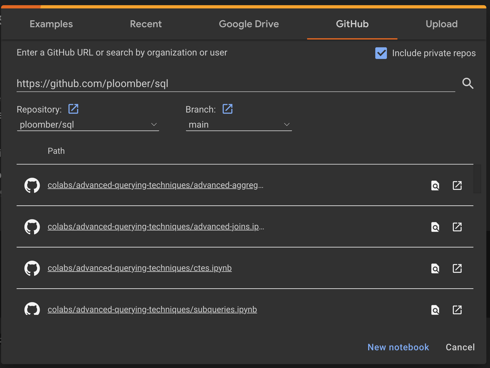

# From zero to hero: end to end data applications with SQL and Jupyter

Meet our [contributors](https://github.com/ploomber/sql/blob/main/docs/contributors/contributors.md)

## Important links

Visit the Jupyter book: https://ploomber-sql.readthedocs.io/en/latest/index.html 

You can explore hands on exercises via Google colab on the `colabs` folder in this repository.

To do so:

1. Open [Google Colab](https://colab.research.google.com/)
2. To open a Jupyter notebook from this repository, change to the GitHub tab, and paste https://github.com/ploomber/sql
3. Press the search icon 🔍
4. Select a notebook

## Set up for contributors

First set up by following the "Setup" section of `CONTRIBUTING.md`. Linked [here](https://github.com/ploomber/sql/blob/main/CONTRIBUTING.md)

After cloning this repository and activating your environment, view the course by building the documents. 

To do so, run 

`jupyter-book build docs/` 

in your command line. 

Make sure your working directory is at `/sql`, which is the top level of the cloned repository.

## Course structure

Display the topics

### Intro to SQL

Display the topics

1. Connecting to database engines
2. Making your first query
3. Aggregate functions in SQL
4. Joining data in SQL
5. Combining data from multiple tables 

### Interactive queries and parameterization

1. Introduction to `ipywidgets`
2. Parameterize your SQL queries
3. Make your queries interactive

### Advanced querying techniques

1. Writing subqueries
2. Advanced joins
3. Advanced aggregations

### Visualizing your SQL queries

1. Types of data visualizations
2. What makes a visualization good
3. Plotting with `seaborn`
4. Plotting with `plotly`
5. SQL query visualization with `ggplot`

### Packaging your SQL project

1. Introduction to the dataset and problem
2. Intro to Python scripting
3. Intro to ETL pipelines with Python and SQL
4. Packaging your ETL pipeline with Ploomber and Docker

### Introduction to dashboards and apps

1. Connecting the ETL pipeline to a dashboard (Voila)

### Mini project - movie recommender system
1. Introduction
2. Setting up your environment with `Poetry`
3. Set up an ETL with Python, DuckDB and Ploomber
4. Perform exploratory data analysis
5. Set up recommender system
6. Serving results with FastAPI and Docker
7. Deploying your application

### Deploying your SQL application

1. Cloud-based options
2. Automating CI/CD with GitHub actions
3. Sample AWS deployment workflow

