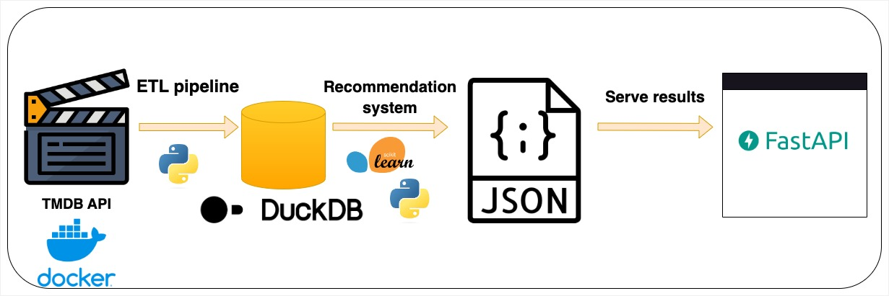

---
jupytext:
  text_representation:
    extension: .md
    format_name: myst
    format_version: 0.13
    jupytext_version: 1.14.6
kernelspec:
  display_name: jupyblog
  language: python
  name: python3
---

# Designing your first movie recommendation system

One of the best ways to demonstrate and solidify your understanding of a topic is by working on a hands-on project. With that in mind, we are thrilled to introduce an exciting mini-project opportunity for the Ploomber community. Not only will this give you a chance to flex your coding muscles, but upon completion, you'll have an impressive showcase for your portfolio!

## Project Overview

Here's a high-level summary of what the project entails:

1. **Data Extraction:** Utilize a Python script to call a movie database API.
2. **Data Storage**: Populate a DuckDB instance with the extracted movie data.
3. **Exploratory Data Analysis (EDA):** Dive deep into the data with SQL-based analysis in a Jupyter notebook. This step will involve extracting data, data wrangling, and creating new tables.
4. **Build a Recommender System:** Use another Jupyter notebook to create a movie recommendation system based on the data you've wrangled.
5. **Packaging:** Package your entire workflow, including notebooks, using Ploomber/Ploomber-engine.
6. **API Deployment:** Serve your recommender system's results as an API using FastAPI.
7. **Dockerization:** Containerize your application using Docker for easy deployment and scaling.

## Ensuring Code Reproducibility

For this project, we will be working with [Poetry](https://python-poetry.org/docs/), a Python dependency management and packaging tool. It allows you to declare the libraries your project depends on and it will manage (install/update) them for you. This ensures that our code is reproducible across different machines.

Additionally, we will be using [Ploomber](https://ploomber.readthedocs.io/en/stable/), a Python library that allows you to build data pipelines using Python scripts and Jupyter notebooks. Ploomber is a great tool for data scientists who want to build data pipelines without having to learn new tools or languages. It also allows you to package your entire workflow, including notebooks, into a Python package.

Finally, to ensure we can execute our code in a consistent environment, we will be using [Docker](https://www.docker.com/). Docker allows us to create a container that contains all the dependencies we need to run our code. This ensures that our code will run the same way on any machine.

## Why Participate?

1. **Real-World Experience:** This project mimics the pipeline of many real-world applications – from data extraction to deployment.
2. **Portfolio Booster:** Showcase your ability to manage and execute a multi-faceted project.
3. **Skill Enhancement:** Refine your skills with Python, SQL, Ploomber, FastAPI, and Docker.

## Requirements

It is recommended that you have the following installed on your system:

1. Python 3.10+ (3.10 recommended)
2. Miniconda or Anaconda installed. [Link here](https://docs.conda.io/projects/conda/en/latest/user-guide/install/index.html)
3. An IDE and Jupyter notebooks installed. We will be working with [VSCode](https://code.visualstudio.com/docs/setup/setup-overview) and Jupyter notebooks in this tutorial.
4. Docker Engine installed. [Link here](https://docs.docker.com/engine/install/)
5. Poetry setup (covered in the next section)

## Get Started!

Excited? We hope so! Jump right in and follow the outlined steps to kick-start your journey. This is a fantastic way to bring together various aspects of the data science pipeline and see them in action.
